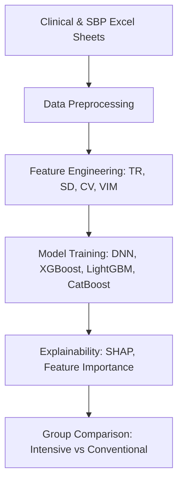

# 🧠 OPTIMAL-BP AI: Prediction of 3-Month Functional Outcomes Using SBP Metrics and Explainable AI

### 📖 Overview
This repository contains the core scripts and workflow for the secondary analysis of the **OPTIMAL-BP randomized clinical trial (2020–2022, 19 centers, N = 306)**.  
The project investigates how different systolic blood pressure (SBP) control strategies influence 90-day outcomes after endovascular thrombectomy using machine learning and explainable AI (XAI).

---

### ⚙️ Workflow Overview


---

### 🧩 Key Components
| File | Description |
|:--|:--|
| **`data_preprocessing.py`** | Preprocess clinical and SBP tables, generate per-phase (p0/p15/p30/p45) grids, and compute BPV metrics (TR, SD, CV, VIM). |
| **`model_creation.py`** | Define and compile deep neural network models for binary classification (mRS 0–2 vs 3–6). |
| **`tuning_models.py`** | Hyperparameter search using randomized grid or Bayesian optimization. |
| **`run_train.py`** | Main training routine (model training, validation, and saving). |
| **`run_train_call.py`** | Entry script for local execution (Python script or notebook). |
| **`model_evaluation.py`** | Evaluate models with ROC, PR curves, and classification metrics. |
| **`compare_auc_delong.py`** | Statistical comparison of AUCs using DeLong’s test. |
| **`shap_analysis.py`** | Compute SHAP values for explainability and visualize feature importance. |
| **`run_tune.py`** | Run hyperparameter tuning and save optimal configurations. |

---

### 🧬 Data Description
**Dataset:** OPTIMAL-BP randomized trial (June 2020 – Nov 2022)  
**Sample:** 288 per-protocol patients (Intensive 148 | Conventional 140)  
**Outcome:** 90-day mRS (0–2 = Good / 3–6 = Poor)  

**SBP inputs used:**  
`Systolic_enroll`, `systolic_overall_max`, `systolic_overall_min`, `systolic_overall_mean`  

**BPV features:**  
- `TR` (Time-Rate of SBP change)  
- `SD` (Standard Deviation)  
- `CV` (Coefficient of Variation)  
- `VIM` (Variation Independent of Mean)

---

### 🧮 Modeling Approach
| Step | Method |
|:--|:--|
| **Feature scaling** | StandardScaler per group (Intensive / Conventional) |
| **Models** | DNN, XGBoost, LightGBM, CatBoost |
| **Loss / Metrics** | Binary cross-entropy, AUC-ROC, AUC-PR, Accuracy, Precision, Recall |
| **Explainability** | SHAP-based feature importance and dependence analysis |

---

### 📂 Folder Structure
```
OPTIMAL_BP_AI/
│
├── src/
│   ├── compare_auc_delong.py
│   ├── data_preprocessing.py
│   ├── model_creation.py
│   ├── model_evaluation.py
│   ├── run_train.py
│   ├── run_train_call.py
│   ├── run_tune.py
│   ├── shap_analysis.py
│   └── tuning_models.py
│
├── data/                      # Excel input files (not included)
└── results/
    ├── reports/               # model reports and metrics (auto-generated)
    └── models/                # saved model files (.keras, .pkl)
```

*Note:*  
The `figures/` and `results/` directories are **not uploaded to GitHub**,  
but are automatically created when you run the training script.  
All generated reports and model files are stored in `results/reports/` and `results/models/`.

---

### 🧰 Dependencies
```bash
Python >= 3.8
pandas >= 2.0
numpy >= 1.23
scikit-learn >= 1.3
tensorflow >= 2.3
lightgbm >= 4.0
xgboost >= 2.0
catboost >= 1.2
shap >= 0.44
matplotlib, seaborn, joblib, openpyxl
```

Install all dependencies:
```bash
pip install -r requirements.txt
```

---

### 🚀 How to Run

#### ✅ From terminal or command line
```bash
python src/run_train_call.py
```

---

### 📊 Outputs
- Model training logs and evaluation reports → `results/reports/`
- Saved model files (.keras / .pkl) → `results/models/`
- SHAP feature importance plots (if enabled) → generated dynamically in `shap_analysis.py`

---

*Last updated: October 2025*
